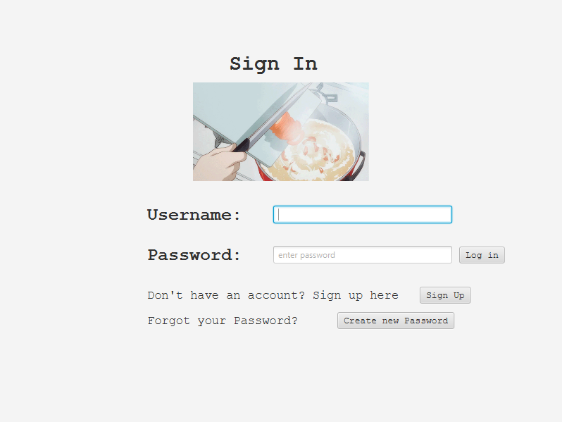
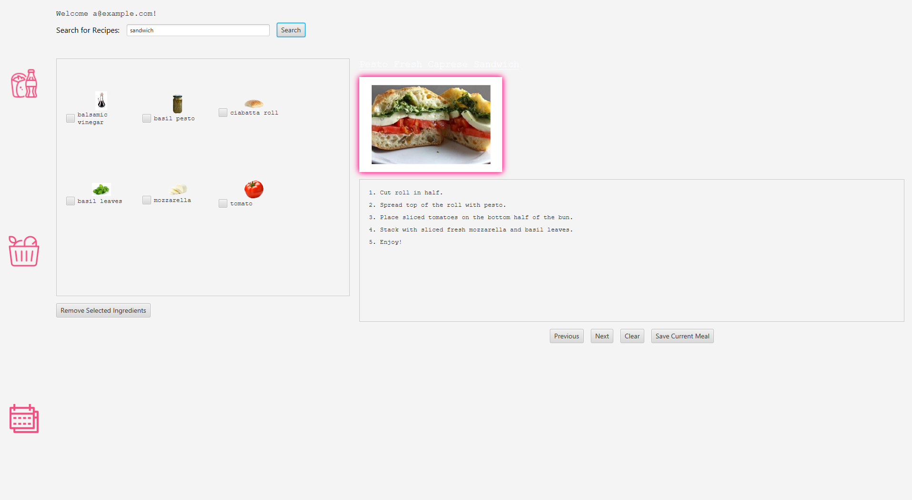
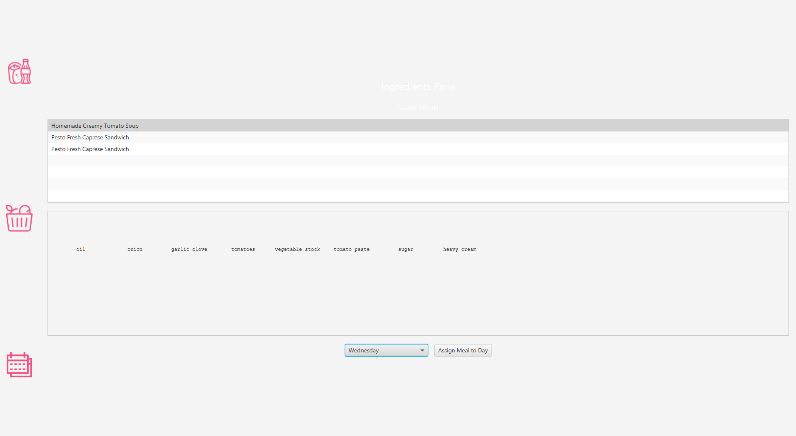
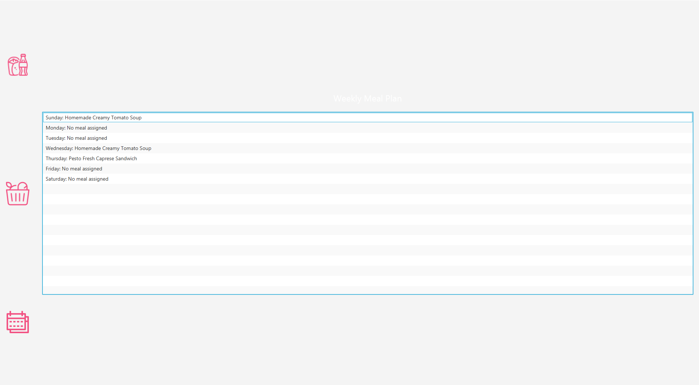

# Meal Prep Tech


A JavaFX-based meal planning application that helps users organize their meals, search for recipes, and manage dietary preferences.


## Features

###  Recipe Search & Management
- Search recipes using Spoonacular API
- View detailed recipe information (ingredients, instructions, images)
- Save favorite meals to your personal collection
- Filter recipes by dietary preferences

###  Meal Planning
- Weekly calendar view for meal planning
- Drag-and-drop meal assignment
- Persistent meal plan storage
- Quick overview of weekly nutrition

###  User Management
- Secure account creation with password hashing
- Dietary preference tracking
- Personalized recipe recommendations
- Password change functionality

###  Ingredients Management
- Interactive ingredient lists
- Check-off system for grocery shopping
- Custom ingredient modifications
- Shopping list generation

## Technologies Used

### Backend
- **Java 17+** - Core application language
- **JavaFX** - UI framework
- **SQLite** - Database storage
- **JDBC** - Database connectivity
- **BCrypt** - Password hashing
- **Apache HttpClient** - API communication
- **Gson** - JSON parsing

### Frontend
- **FXML** - UI markup
- **CSS** - Styling
- **Animations** - Smooth transitions between screens

### API Integration
- **Spoonacular API** - Recipe data source

## Setup Instructions

### Prerequisites
- Java 17 or later
- Maven
- Internet connection (for API access)

### Installation
1. Clone the repository:
   ```bash
   git clone https://github.com/yourusername/meal-prep-tech.git
   cd meal-prep-tech
   ```
2. Build the project
   ```bash
   mvn clean install
    ```
3. Run the application:
    ```bash
   mvn javafx:run
    ``` 
   
### Configuration
1. Obtain a Spoonacular API key from spoonacular.com
2. Add your API key to RecipeServer.java:
    ```java
   private static final String API_KEY = "your-api-key-here";
    ```
## Screenshots
### Login Screen

### Recipe Search Screen

### Meal List Screen

### Weekly Planning Screen


